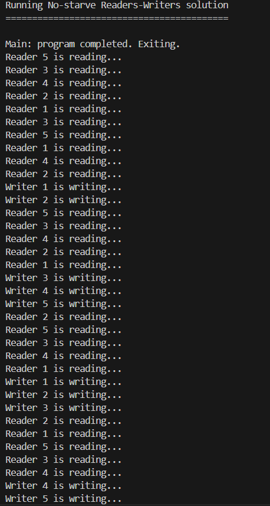
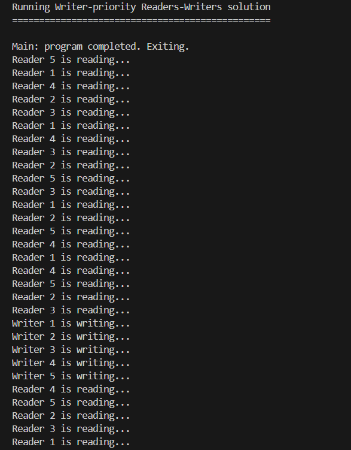
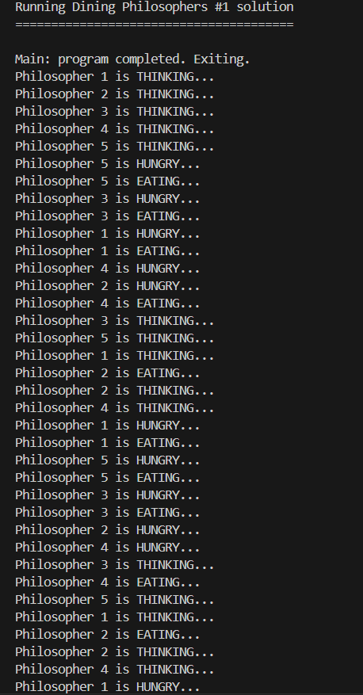
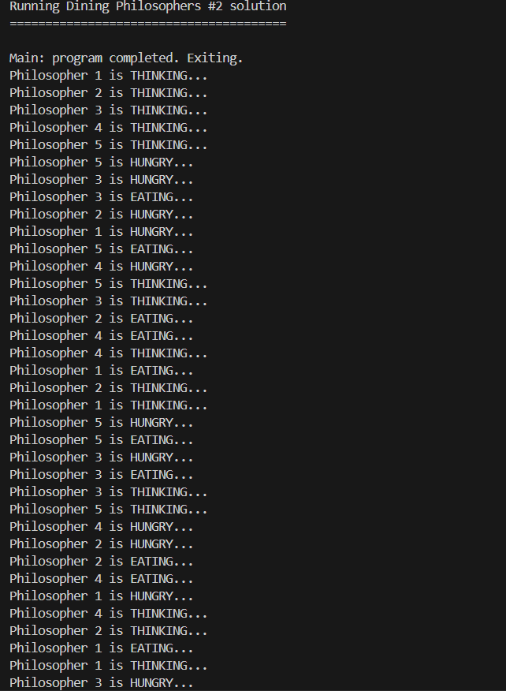

# cse4001_sync_problems

1. No-Starve Readers-Writers: Uses a turnstile semaphore that both readers and writers must pass through, ensuring fairness. Readers can read simultaneously using a lightswitch pattern, but writers get exclusive access by holding both the turnstile and room semaphores.

2. Writer-Priority Readers-Writers: Writers block new readers from entering via the readTry semaphore when any writer is waiting. Multiple readers can read simulatenously, but once a writer arrives, it prevents new readers until all waiting writers complete, giving writers priority over readers.

3. Dining Philosophers #1 (Tanenbaum): Uses state tracking with a test function that only allows a philosopher to eat if both neighbors aren't eating. A mutex protects state changes and an array of semaphores blocks hungry philosophers until their turn, preventing a deadlock through centralized coordination.

4. Dining Philosophers #2 (Asymmetric): Breaks the circular wait condition by having even-numbered philosophers pick up their left fork first while odd-numbered philosophers pick up their right fork first. This asymmetric approach ensures at least one philosopher can always acquire both forks, preventing deadlocks without limiting table occupancy.
